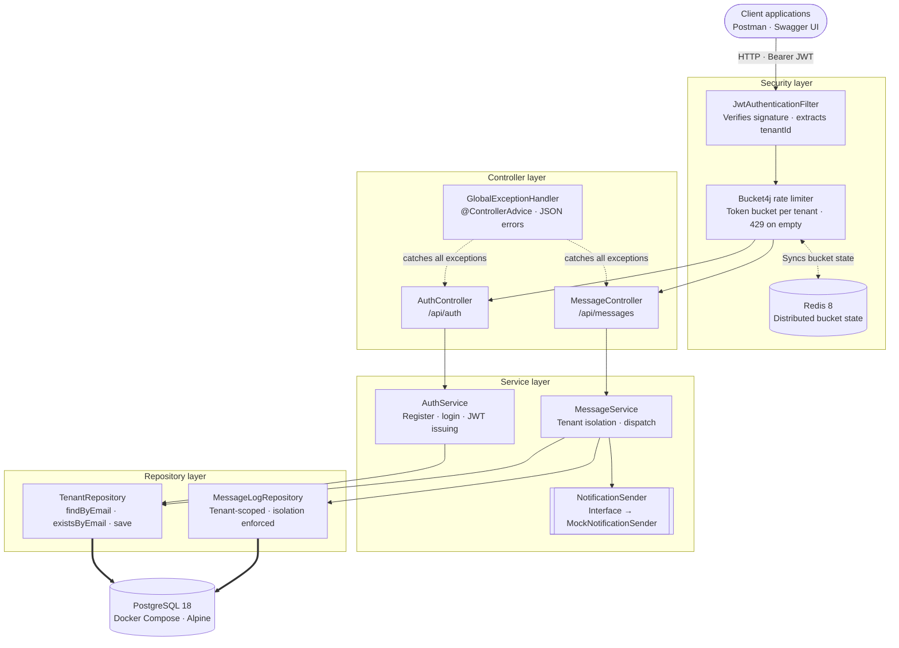
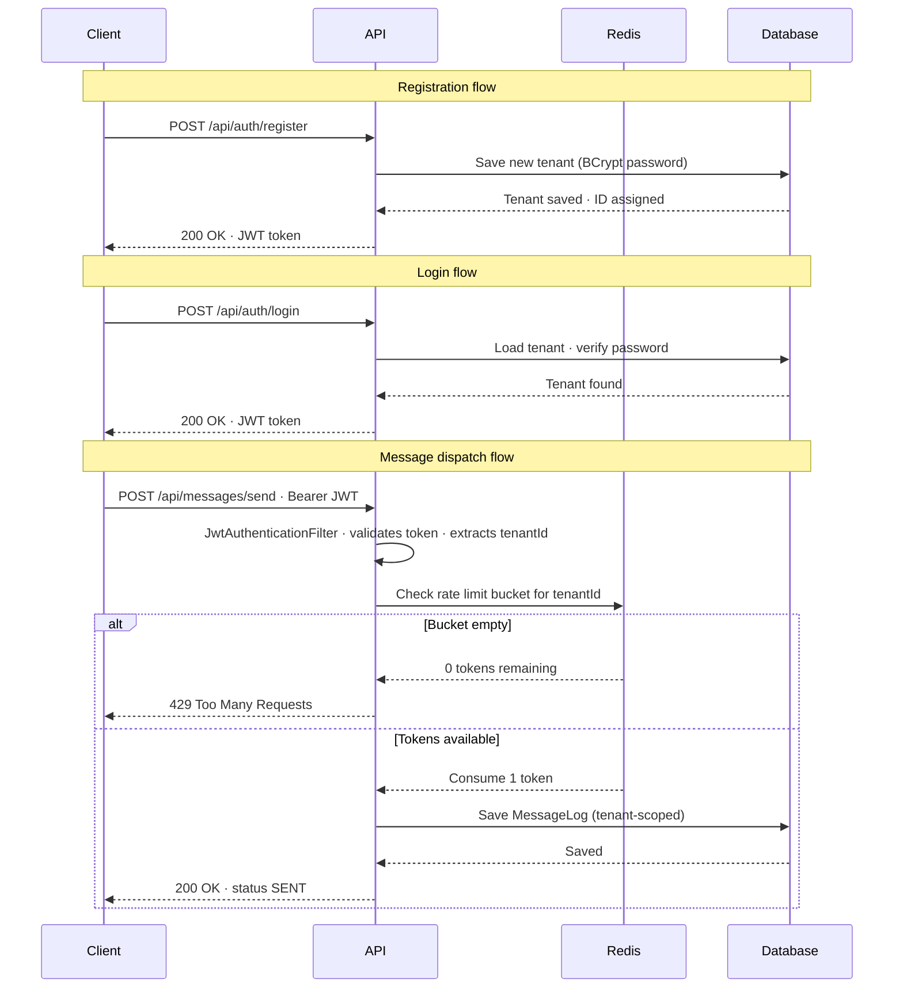

# Herald

Herald is a multi-tenant notification service API that allows independent
companies (tenants) to send and manage notifications through a single 
centralized backend.
Built with Spring Boot, it demonstrates real-world backend engineering 
practices including JWT-based authentication, per-tenant data isolation and 
rate limiting. Each tenant operates in a fully sandboxed environment so no 
company can access another's data or exhaust shared resources.

## Tech Stack

| Component      | Technology                                    |
|----------------|-----------------------------------------------|
| Framework      | Spring Boot 4 (Java 25)                       |
| Database       | PostgreSQL                                    |
| Rate Limiting  | Bucket4j (in-memory) + Lettuce (Redis-Backed) |
| State / Cache  | Redis 8                                       |
| Security       | Spring Security + JWT                         |
| Docs           | Springdoc / Swagger UI                        |
| Infrastructure | Docker Compose                                |
| Testing        | JUnit 5, Mockito, Spring MockMvc, H2 DB       |

## Architecture



## How it works



## API Endpoints

| Method | Endpoint               | Description                                  | Auth |
|--------|------------------------|----------------------------------------------|------|
| POST   | /api/auth/login        | Returns a signed JWT token                   | No   |
| POST   | /api/auth/register     | Register a new tenant account                | No   |
| POST   | /api/messages/send     | Send a notification (rate-limited)           | Yes  |
| GET    | /api/messages/history  | Get current tenant's message history         | Yes  |
| GET    | /api/messages/{id}     | Fetch a single message by ID (tenant-scoped) | Yes  |

## Getting Started

### Prerequisites

- [Docker Desktop](https://www.docker.com/products/docker-desktop)
- Java 25 ([Temurin](https://adoptium.net) or similar)
- Maven 3.9+

### Setup

1. Clone the repository

```bash
  git clone https://github.com/guillemdiaz/herald.git
  cd herald
```

2. Configure the environment

```bash
  cp src/main/resources/application.yml.example src/main/resources/application.yml
```

3. Start the infrastructure (PostgreSQL & Redis)

```bash
  docker compose up -d
```

4. Run the application

```bash
  mvn spring-boot:run
```

5. Explore the API Docs opening Swagger UI at 
   `http://localhost:8080/swagger-ui/index.html`

## Running the tests

Tests run against an in-memory H2 database and an isolated 
`@Profile("test")` rate limiter (no Docker required).

```bash
mvn test
```

## Future Improvements

- Paginate `/api/messages/history` with Spring Data `Pageable`
- Make `/api/messages/send` async with `@Async`, returning `202 Accepted` 
  immediately while delivery happens in the background